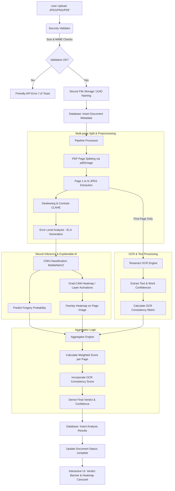

# DocForge — Intelligent Document Forgery Detection System
**MCA Major Project 2024–25 · Bhoomi Gupta**

AI-powered web application that detects forgery in uploaded document images and multi-page PDFs using Computer Vision, Deep Learning, and optical analysis.

---

## ── Table of Contents ──
1. [Executive Summary & Abstract](#1-executive-summary--abstract)
2. [End-to-End System Architecture](#2-end-to-end-system-architecture)
3. [Deep Dive into Pipeline Stages](#3-deep-dive-into-pipeline-stages)
   - [Input Validation & Secure Storage](#input-validation--secure-storage)
   - [Preprocessing & Image Enhancements](#preprocessing--image-enhancements)
   - [Error Level Analysis (ELA)](#error-level-analysis-ela)
   - [Neural Inference Model](#neural-inference-model)
   - [Explainable AI (XAI) Heatmaps](#explainable-ai-xai-heatmaps)
   - [Tesseract OCR Heuristics](#tesseract-ocr-heuristics)
   - [Weighted Multi-Page Decision Aggregator](#weighted-multi-page-decision-aggregator)
4. [Database Architecture & Schema](#4-database-architecture--schema)
5. [Machine Learning Training Pipeline](#5-machine-learning-training-pipeline)
   - [MobileNetV2 Transfer Learning](#mobilenetv2-transfer-learning)
   - [Document-Specific Transfer (Synthetic Authentic Generation)](#document-specific-transfer-synthetic-authentic-generation)
6. [Complete Codebase Component Directory](#6-complete-codebase-component-directory)
7. [REST API Specifications](#7-rest-api-specifications)
8. [UI/UX Frontend Walkthrough](#8-uiux-frontend-walkthrough)
9. [Testing & Verification Framework](#9-testing--verification-framework)
10. [Quick Start & Production Deployment](#10-quick-start--production-deployment)

---

## 1. Executive Summary & Abstract
In the modern digital landscape, the alteration and fabrication of documents (invoices, credentials, financial records) pose massive security threats. **DocForge** is an advanced web-based forensic suite designed to automatically scan, analyze, and detect structural forgery in document images (`.jpg`, `.jpeg`, `.png`) and `.pdf` files. 

DocForge utilizes a multi-layered detection pipeline:
- **CNN Classification:** A deep convolutional neural network based on MobileNetV2 analyzes visual features for anomalies, textures, and spliced edges.
- **Error Level Analysis (ELA):** A compression-based analysis that isolates regions of varying JPEG compression ratios, signaling foreign element insertion (splicing).
- **OCR Confidence Analytics:** A text-level heuristic that measures Tesseract word confidences to flag inconsistent fonts, sizes, and localized text blurring indicative of document editing.
- **Grad-CAM Visualization:** Explainable AI (XAI) mapping that highlights the exact areas of concern using colored heatmaps overlaid directly on the original document.

---

## 2. End-to-End System Architecture
The system follows a synchronous, stage-gated modular architecture:



---

## 3. Deep Dive into Pipeline Stages

### Input Validation & Secure Storage
Managed by [validator.py](file:///Users/bhoomigupta/Documents/major%20project/utils/validator.py) and [file_handler.py](file:///Users/bhoomigupta/Documents/major%20project/utils/file_handler.py).
1. **Byte-Level Signature Check:** Rather than trusting browser-claimed headers, `validator.py` peeks at the first `2048` bytes of the file stream using `python-magic` (Libmagic wrapper) to determine the true MIME type. Files masking their true extensions are immediately rejected.
2. **Whitelist Gates:** Checks against a strict extension whitelist (`.jpg`, `.jpeg`, `.png`, `.pdf`) and MIME types (`image/jpeg`, `image/png`, `application/pdf`).
3. **Capacity Boundaries:** Restricts file sizes to `10 MB` (configured via `MAX_CONTENT_LENGTH` in [config.py](file:///Users/bhoomigupta/Documents/major%20project/config.py)) to prevent Denial of Service (DoS) attacks.
4. **Collision and Traversal Defenses:** `file_handler.py` assigns a randomized `UUIDv4` filename stem to each upload, stripping any user-submitted filenames. This eliminates directory traversal vulnerability (`../../etc/passwd`) and file collisions.

---

### Preprocessing & Image Enhancements
Managed by [preprocessor.py](file:///Users/bhoomigupta/Documents/major%20project/pipeline/preprocessor.py).
1. **Multi-Page Spooling:** If the uploaded file is a PDF, `_pdf_to_images` leverages `pdf2image` and Poppler to render all PDF pages as separate high-resolution JPEG images (`200 DPI`). Single images are wrapped in a 1-page iterator.
2. **Standardization & Resizing:** Resolves the images to `224×224 px` using bilinear interpolation (`cv2.resize` with `cv2.INTER_AREA`), standardizing inputs for neural network tensor expectations.
3. **Contrast Adaptive Normalization (CLAHE):** To combat shadows and uneven scanner lighting, the image is converted to the `LAB` color space. CLAHE (Contrast Limited Adaptive Histogram Equalization) is executed specifically on the Lightness (`L`) channel with a clip limit of `2.0` and grid dimensions of `8×8`, then merged back to `BGR`. This sharpens and uniformizes text and alteration edges.
4. **Denoising:** A `3×3` Gaussian filter smoothly filters scanner noise while preserving crucial structural text outlines.
5. **Deskewing Algorithm:**
   - Obtains a binary representation of the image via Otsu's thresholding (`cv2.THRESH_BINARY | cv2.THRESH_OTSU`) over an inverted grayscale canvas.
   - Collects all positive coordinate contours and determines the minimum area bounding rectangle (`cv2.minAreaRect`).
   - Translates the rotation angle. To prevent accidental 90-degree flips on highly rotated documents, the rotation correction is strictly bound within a `[-45, 45]` degree interval.
   - Warps the image back to perpendicularity using affine transformations (`cv2.getRotationMatrix2D` and `cv2.warpAffine`).

---

### Error Level Analysis (ELA)
Managed by [preprocessor.py](file:///Users/bhoomigupta/Documents/major%20project/pipeline/preprocessor.py#L128-L148).
When a JPEG image is saved, the entire image is compressed uniformly. If a region of the document is altered (e.g. text spliced from another document or modified digitally) and saved, that specific region will have undergone different levels of compression history compared to the untouched areas.

DocForge generates an ELA image:
1. Resaves the preprocessed image to a temporary file at a fixed JPEG quality of `75%`.
2. Reloads this compressed version.
3. Calculates the absolute difference between the original preprocessed image and the compressed image:
   $$\text{Difference} = |I_{\text{original}} - I_{\text{compressed}}|$$
4. Amplifies this difference by a scale factor of `10` and clips pixel intensities between `0` and `255`:
   $$\text{ELA} = \min(\max(\text{Difference} \times 10, 0), 255)$$
5. Spliced regions appear as highly bright pixel groups, whereas untouched regions show uniform dark/dim pixel structures.

---

### Neural Inference Model
Managed by [detector.py](file:///Users/bhoomigupta/Documents/major%20project/pipeline/detector.py).
The deep neural classifier uses a fine-tuned **MobileNetV2** base architecture pre-trained on ImageNet, chosen for its light footprint and high feature extraction performance.

*   **Tensor Processing:** Preprocessed arrays are normalized to `[0.0, 1.0]` by dividing pixel values by `255.0` and expanded into a batch dimension `(1, 224, 224, 3)`.
*   **Classification Head:**
    *   `GlobalAveragePooling2D` (reduces spatial dimensions of MobileNet's final convolutional layer from $7\times7\times1280$ to a 1280-dimension vector).
    *   `Dense` Layer (`256` nodes, `ReLU` activation, with `BatchNormalization`).
    *   `Dropout` Layer (`0.5` drop probability for regularizing co-adaptation).
    *   `Dense` Layer (`128` nodes, `ReLU` activation).
    *   `Dropout` Layer (`0.3` drop probability).
    *   `Dense` Output Layer (`2` nodes, `Softmax` activation) yielding probability distribution: `[P(Authentic), P(Forged)]`.
*   **Robust Mock Mode:** If the model weights (`forgery_model.h5`) are missing or failed to initialize, the system enters a robust mock fallback mode. Instead of crashing, it returns `verdict = 'unknown'` and isolates ELA metrics so that the user interface remains responsive.

---

### Explainable AI (XAI) Heatmaps
Managed by [detector.py](file:///Users/bhoomigupta/Documents/major%20project/pipeline/detector.py#L153-L267).
To ensure model decisions are transparent and audit-proof, DocForge implements a visual explanation routing chain with three cascading strategies:

#### 1. Grad-CAM (Primary Strategy)
Uses TensorFlow's `GradientTape` to compute gradients of the winning class score ($y^c$) with respect to the feature map activations ($A^k$) of the network's final 2D convolutional layer:
$$w_k^c = \frac{1}{Z} \sum_{i} \sum_{j} \frac{\partial y^c}{\partial A_{i, j}^k}$$
A weighted sum of the activations is computed, followed by a ReLU operation to filter out features that do not positively influence the forgery class:
$$L_{\text{Grad-CAM}}^c = \text{ReLU}\left(\sum_{k} w_k^c A^k\right)$$
The resulting single-channel heatmap is normalized between `0.0` and `1.0`.

#### 2. Activation Mapping (Secondary Strategy)
If `GradientTape` gradients are zero or fail, the system aggregates the activation map from the final convolutional layer directly by taking the channel-wise average of the layer's activations:
$$\text{Heatmap} = \frac{1}{K} \sum_{k=1}^{K} A^k$$
This highlights raw feature anomalies.

#### 3. ELA Heatmap (Tertiary Strategy)
If TensorFlow is run on a platform without weight loading or in full mock mode, the system maps the spatial density of ELA high-frequency residuals directly, applying a Gaussian smoothing filter to form hot zones.

#### Visualization Rendering:
The 2D normalized heatmap is scaled to the original dimensions, colorized using the `cv2.COLORMAP_JET` spectrum (red represents high alteration confidence, blue represents original structural background), and overlaid on the preprocessed image:
$$\text{Overlay} = 0.6 \times I_{\text{original}} + 0.4 \times I_{\text{color\_heatmap}}$$

---

### Tesseract OCR Heuristics
Managed by [ocr.py](file:///Users/bhoomigupta/Documents/major%20project/pipeline/ocr.py).
To detect spliced text blocks or characters modified using varying fonts or resolutions, DocForge monitors text extraction metadata:
1. **Automatic Page Segmentation:** Executes pytesseract on the first page image using `--psm 3` (Fully automatic page segmentation without OSD).
2. **Metadata Extraction:** Extracts details for every text token, including: Bounding box coordinates $(x, y, w, h)$ and extraction confidence (0-100 scale).
3. **Consistency Metric:** Words altered/spliced into a scanned document often display minor blurring or alignment errors, creating variations in Tesseract's extraction confidence relative to untouched text. The system tracks this inconsistency by calculating the standard deviation of word-level confidences (discussed below).

---

### Weighted Multi-Page Decision Aggregator
Managed by [aggregator.py](file:///Users/bhoomigupta/Documents/major%20project/pipeline/aggregator.py).
DocForge aggregates multi-page pipeline inputs into a single document verdict:

#### 1. Page-Level Fusion Score
For each page, ELA and CNN predictions are fused using configured weights:
$$S_{\text{page}} = (P_{\text{CNN}} \times w_{\text{CNN}}) + (P_{\text{ELA}} \times w_{\text{ELA}})$$
*(By default: $w_{\text{CNN}} = 0.40$, $w_{\text{ELA}} = 0.50$)*

#### 2. OCR Inconsistency Score
Calculates the standard deviation of OCR word confidences to determine text inconsistency. A high standard deviation signals text manipulation, variable blur, or font mismatching:
$$S_{\text{OCR}} = \min\left(\frac{\text{Standard Deviation}(\text{Confidences})}{30.0}, 1.0\right)$$

#### 3. Document-Level Aggregation
The base document confidence is determined by the most anomalous page (worst-case assumption), which is then combined with the text-level OCR score:
$$\text{Confidence}_{\text{Base}} = \max(S_{\text{page\_1}}, S_{\text{page\_2}}, \dots, S_{\text{page\_N}})$$
$$\text{Confidence}_{\text{Document}} = \min\left(\max\left(\text{Confidence}_{\text{Base}} \times (1 - w_{\text{OCR}}) + (S_{\text{OCR}} \times w_{\text{OCR}}), 0.0\right), 1.0\right)$$
*(By default: $w_{\text{OCR}} = 0.10$)*

#### 4. Verdict Assignment
$$\text{Verdict} = \begin{cases} 
      \text{unknown} & \text{if all page CNN confidences are } 0.0 \text{ (Mock Mode)} \\
      \text{forged} & \text{if } \text{Confidence}_{\text{Document}} \ge 0.25 \\
      \text{authentic} & \text{if } \text{Confidence}_{\text{Document}} < 0.25 
   \end{cases}$$

---

## 4. Database Architecture & Schema
The database layer ([adapter.py](file:///Users/bhoomigupta/Documents/major%20project/db/adapter.py) and [schema.sql](file:///Users/bhoomigupta/Documents/major%20project/db/schema.sql)) uses a local SQLite implementation.

### WAL Mode
To enable high-concurrency performance, the connection factory initializes with Write-Ahead Logging (WAL) and enforces foreign keys:
```sql
PRAGMA journal_mode = WAL;
PRAGMA foreign_keys = ON;
```
*   **WAL Mode Benefit:** Allows concurrent reads to proceed without being blocked by active database writes, ensuring fast dashboard load times under concurrent uploads.

### Database Tables

#### Table: `documents`
Stores metadata for uploaded files.
| Column | Type | Constraints | Description |
|---|---|---|---|
| `id` | TEXT | PRIMARY KEY, NOT NULL | UUID unique identifier |
| `filename_orig` | TEXT | NOT NULL | Original user filename |
| `filename_stored`| TEXT | NOT NULL | UUID filename stored on disk |
| `file_ext` | TEXT | NOT NULL | Lowercase normalized extension |
| `file_size_bytes`| INTEGER| NOT NULL | Total file size in bytes |
| `mime_type` | TEXT | NOT NULL | True MIME determined via magic |
| `uploaded_at` | TEXT | NOT NULL | ISO-8601 UTC timestamp |
| `status` | TEXT | CHECK (status IN ('pending', 'processing', 'complete', 'error')) | Pipeline status tracker |

#### Table: `analysis_results`
Stores detailed forgery analysis results. Relies on a cascade delete link to `documents`.
| Column | Type | Constraints | Description |
|---|---|---|---|
| `id` | TEXT | PRIMARY KEY, NOT NULL | Unique result ID |
| `document_id` | TEXT | REFERENCES `documents` ON DELETE CASCADE | Parent document ID link |
| `verdict` | TEXT | CHECK (verdict IN ('authentic', 'forged', 'unknown')) | Combined final verdict |
| `confidence` | REAL | NOT NULL | Document-level confidence |
| `detections` | TEXT | NULL | JSON string array of details |
| `annotated_image`| TEXT | NULL | Heatmap filename for display |
| `ocr_text` | TEXT | NULL | Raw text extracted from page 1 |
| `processing_ms` | INTEGER| NULL | Total execution duration |
| `model_version` | TEXT | NULL | Version of the active model |
| `analysed_at` | TEXT | NOT NULL | ISO-8601 analysis timestamp |
| `error_message` | TEXT | NULL | Details if pipeline failed |
| `total_pages` | INTEGER| DEFAULT 1 | Total pages analyzed |
| `pages_summary` | TEXT | NULL | JSON summary of per-page metrics |
| `forged_pages` | TEXT | NULL | JSON array of flagged pages |

---

## 5. Machine Learning Training Pipeline

### MobileNetV2 Transfer Learning
Managed by [train_model.py](file:///Users/bhoomigupta/Documents/major%20project/train_model.py).
Trains the classifier using transfer learning on the CASIA2 image manipulation dataset.

1. **Dataset Structure:** Expects images split into authentic (`Au/`) and tampered (`Tp/`) directories.
2. **Standard Processing:** Resizes to `224×224 px` and normalizes input pixels to `[0, 1]`.
3. **Training Strategy:**
   - **Phase 1 (Base Frozen):** Freezes the pre-trained ImageNet weights in the MobileNetV2 base model. Trains only the custom classification head for 10 epochs using an Adam optimizer ($\eta = 10^{-4}$).
   - **Phase 2 (Fine-Tuning):** Unfreezes the top `30` layers of the MobileNetV2 base model. Resumes training for an additional 10 epochs using a reduced learning rate ($\eta = 10^{-5}$) to fine-tune high-level feature representations without destroying pretrained weights.
4. **Checkpoint Optimization:** Leverages Keras Callbacks:
   - `ModelCheckpoint` to save only the model with the highest validation accuracy.
   - `EarlyStopping` with a patience of 5 epochs.
   - `ReduceLROnPlateau` to halve the learning rate if the validation loss plateaus.

---

### Document-Specific Transfer (Synthetic Authentic Generation)
Managed by [train_documents_only.py](file:///Users/bhoomigupta/Documents/major%20project/train_documents_only.py).
When training on real documents, a common challenge is having access to tampered document samples without corresponding authentic reference scans. To address this, `train_documents_only.py` implements a pipeline to create synthetic authentic counterparts from forged documents:

#### Method 1: Scan Simulation
- Strips color channels by converting the image to grayscale, removing color-splicing clues.
- Applies uniform CLAHE normalization (limit `1.5`) to eliminate localized exposure anomalies.
- Adds mild Gaussian blur (`3×3`) to smooth sharp, synthetic editing boundaries.
- Re-saves the image at 95% JPEG quality to establish a uniform compression background.

#### Method 2: Photocopy Simulation
- Converts the image to the `LAB` color space.
- Applies CLAHE (limit `2.0`) to the L channel.
- Reduces color saturation by blending the color channels with a neutral gray matrix (`0.7` weight original + `0.3` neutral).
- Applies a `3×3` median blur to simulate print-scan photocopy distortions.

This pipeline generates a balanced dataset, enabling the model to learn the structural characteristics of scanned/photocopied documents rather than learning to classify document text styles.

---

## 6. Complete Codebase Component Directory

```
major_project/
├── app.py                     # Flask application factory, logs init, health gates
├── run.py                     # High-level entry point to launch development server
├── config.py                  # Single-source runtime constants and configurations
├── migrate_multipage.py       # SQL script to migrate database columns for multi-page support
├── train_model.py             # MobileNetV2 transfer learning script on CASIA2 dataset
├── train_documents_only.py    # Training script featuring synthetic authentic generators
├── requirements.txt           # Declared Python library dependencies and versions
├── docforge.db                # SQLite database storing documents and analysis logs
├── docforge.log               # Live rotating system application logs
│
├── db/                        # Database Interface Layer
│   ├── __init__.py
│   ├── adapter.py             # Thread-safe connection factory and SQLite CRUD operations
│   └── schema.sql             # Table creation script (DDL, Indexes, and Constraints)
│
├── pipeline/                  # Digital Forensics Processing Engine
│   ├── __init__.py
│   ├── preprocessor.py        # PDF page splitting, CLAHE, Deskew, and ELA generator
│   ├── detector.py            # Model loading, neural inference, and XAI heatmap generator
│   ├── ocr.py                 # Pytesseract OCR engine wrapper and bounding-box parser
│   └── aggregator.py          # Weight aggregator combining CNN, ELA, and OCR scores
│
├── utils/                     # Utility Support Services
│   ├── __init__.py
│   ├── validator.py           # Libmagic MIME checking and size restriction gates
│   └── file_handler.py        # UUID generation, file save/delete operations
│
├── routes/                    # Flask blueprints mapping URL endpoints
│   ├── __init__.py
│   ├── upload.py              # Upload screen routes and analysis pipeline trigger
│   ├── results.py             # Single/Multi-page analysis report retrieval routes
│   └── history.py             # Dashboard query routes and detail historical view
│
├── templates/                 # Jinja2 HTML Layout View Engine
│   ├── base.html              # Core skeleton template containing modern theme assets
│   ├── components/            # Reusable UI component modules (banners, action bars)
│   ├── errors/                # Standardized error pages (404, 500)
│   └── screens/
│       ├── upload.html        # Drag-and-drop file upload screen (S-01)
│       ├── progress.html      # Real-time processing progress bar (S-02)
│       ├── results.html       # Combined report, heatmaps, and paginated tabs (S-03)
│       ├── history.html       # Paginated dashboard database search and filter (S-04)
│       └── detail.html        # Archived results viewer featuring breadcrumb navigation (S-05)
│
├── static/                    # Frontend Client Assets
│   ├── css/                   # Modular stylesheet layouts and custom variables
│   └── js/                    # Drag-and-drop, state polling, and lightbox scripts
│
└── tests/                     # Automated Test Suites
    ├── __init__.py
    ├── conftest.py            # Pytest fixtures and mock database initialization
    ├── test_pipeline.py       # Core test suite covering the pipeline and db adapters
    └── test_upload.py         # HTTP test suite testing controllers, limits, and errors
```

---

## 7. REST API Specifications

### Upload Document & Trigger Pipeline
*   **Endpoint:** `POST /api/upload`
*   **Payload Format:** `multipart/form-data`
*   **Request Parameter:** `file` (Binary payload containing JPG, PNG, or PDF)
*   **Success Response (`200 OK`):**
    ```json
    {
      "status": "complete",
      "result_id": "8b51d8de-07a8-44cb-bf5a-273abec4ea17",
      "verdict": "forged",
      "confidence": 0.8542,
      "detections": [
        {
          "type": "ela_artifact",
          "confidence": 0.86,
          "region": null,
          "description": "High ELA residual (score=0.86). Possible double-compression or splicing.",
          "page": 1
        }
      ],
      "annotated_image_url": "/results/8b51d8de-07a8-44cb-bf5a-273abec4ea17_page1_annotated.jpg",
      "processing_ms": 1420,
      "total_pages": 1,
      "forged_pages": [1],
      "pages": [
        {
          "page_number": 1,
          "verdict": "forged",
          "confidence": 0.8542,
          "original_url": "/results/8b51d8de-07a8-44cb-bf5a-273abec4ea17_page1.jpg",
          "heatmap_url": "/results/8b51d8de-07a8-44cb-bf5a-273abec4ea17_page1_annotated.jpg",
          "detections": [...]
        }
      ]
    }
    ```
*   **Error Response (`400 Bad Request` or `413 Payload Too Large` or `500 Server Error`):**
    ```json
    { "error": "File size exceeds the 10 MB limit. Please compress or re-scan the document." }
    ```

---

### Fetch Analysis Status
Used by the frontend to poll for progress updates.
*   **Endpoint:** `GET /analyse/status?result_id=<UUID>`
*   **Success Response (`200 OK`):**
    ```json
    {
      "stage": 2,
      "status": "processing"
    }
    ```
    *(Stage mapping: `pending` = 0, `processing` = 2, `complete` = 3, `error` = 3)*

---

### Get Detailed Results
*   **Endpoint:** `GET /api/result/<document_uuid>`
*   **Success Response (`200 OK`):** Returns the complete analysis result, including per-page summaries, extracted OCR text, and processing duration.

---

### Fetch Analysis History
*   **Endpoint:** `GET /api/history`
*   **Query Parameters:**
    *   `page` (default: `1`) - Target page index.
    *   `limit` (default: `10`, maximum: `100`) - Number of items per page.
    *   `verdict` (optional) - Filter by `'authentic'` or `'forged'`.
    *   `sort` (default: `'date'`) - Sort by `'date'`, `'filename'`, `'verdict'`, or `'confidence'`.
    *   `dir` (default: `'desc'`) - Sort order (`'asc'` or `'desc'`).
    *   `q` (optional) - Search text to filter by original filename.
*   **Success Response (`200 OK`):**
    ```json
    {
      "page": 1,
      "limit": 10,
      "total": 45,
      "items": [
        {
          "document_id": "8b51d8de-07a8-44cb-bf5a-273abec4ea17",
          "filename_orig": "tax_invoice_2025.pdf",
          "uploaded_at": "2026-05-30T07:12:44Z",
          "status": "complete",
          "result_id": "a9fd84a1-0cf2-4bc7-b892-db836c2e2c04",
          "verdict": "forged",
          "confidence": 0.8542,
          "confidence_pct": 85,
          "total_pages": 3
        }
      ]
    }
    ```

---

### Cancel / Delete Analysis
*   **Endpoint:** `DELETE /analyse/<document_uuid>`
*   **Success Response (`200 OK`):**
    ```json
    {}
    ```

---

## 8. UI/UX Frontend Walkthrough

### S-01: Drag-and-Drop Upload Screen (`/`)
*   **Aesthetics:** Styled with a modern dark theme featuring deep navy, slate gray, and bright electric teal accent colors.
*   **Upload Area:** Implements a drag-and-drop zone using vanilla JavaScript to handle dragover, dragleave, and drop events. Displays real-time warnings for invalid file types or sizes before making API calls.
*   **Navigation:** Provides access to the history dashboard.

---

### S-02: Analysis Progress Screen (`/analyse?result_id=<UUID>`)
*   **Workflow:** Displays while the backend processes the file.
*   **Feedback:** Shows a progress indicator that matches the active processing stage by polling `/analyse/status`.
*   **Control:** Includes a cancel button (`DELETE /analyse/<UUID>`) to terminate the process and return to the main screen.

---

### S-03: Analysis Results Report (`/result/<UUID>`)
*   **Verdict Banner:** Highlights the document's authenticity at the top of the page using color-coded banners (Green for Authentic, Red for Forged, Gray for Inconclusive).
*   **Multi-Page Tab Bar:** Shows a tab interface for PDFs with multiple pages. Users can click tabs to switch between the overall summary and individual pages. Pages flagged as forged display a warning badge (`!`).
*   **Interactive Image Comparison:** Displays the original page next to the detected anomaly heatmap. Users can click either image to open a full-screen, high-resolution lightbox view.
*   **Detailed Findings Table:** Lists all detected anomalies with their corresponding type, description, confidence rating, and source page number.

---

### S-04: History Dashboard (`/history`)
*   **Aesthetics:** Displays past analyses in a clean list format.
*   **Controls:**
    *   **Search Bar:** Uses a `LIKE %q%` database query to filter files by name.
    *   **Filter Dropdown:** Filters items by final verdict (All, Authentic, Forged).
    *   **Sorting Headers:** Clickable table columns to sort items by upload date, filename, or confidence rating.
*   **Pagination:** Displays ten items per page with rapid loading (<2s) enabled by database indexing and SQLite's WAL mode.

---

### S-05: Archived Result Detail Screen (`/result/<UUID>/detail`)
*   Provides a read-only historical view of a completed analysis. Features a navigation breadcrumb path (`History / Detail View`) and an archived chip to differentiate it from live results.

---

## 9. Testing & Verification Framework
The automated test suite in the `tests/` directory uses `pytest` to verify system logic.

### 1. Unit Tests (`tests/test_pipeline.py`)
- **Aggregator Logic:** Verifies that page-level CNN predictions, ELA scores, and OCR confidence values are correctly aggregated, clamped between `0.0` and `1.0`, and map to the appropriate final verdict.
- **OCR Consistency Heuristic:** Tests the standard deviation heuristic by confirming it yields `0.0` on uniform text and a high positive value when confidence levels fluctuate.
- **Model Fallback:** Verifies that the classifier gracefully falls back to mock mode if weights are missing, preventing system crashes.
- **Database Operations:** Tests the SQLite adapter by performing write, update, read, and delete operations on documents and results tables.

### 2. Integration Tests (`tests/test_upload.py`)
- **Security Check:** Verifies that uploads exceeding `10 MB` are rejected with a `413` status code.
- **MIME Verification:** Uploads corrupted or masked binary streams to verify they are caught and rejected by the validator.
- **Pipeline Orchestration:** Tests the Flask client's end-to-end flow from upload to database insertion.

### Run Tests:
```bash
pytest tests/ -v
```

---

## 10. Quick Start & Production Deployment

### Prerequisite System Libraries

#### macOS (Using Homebrew):
```bash
brew install tesseract poppler libmagic
```

#### Linux (Ubuntu/Debian):
```bash
sudo apt update
sudo apt install -y tesseract-ocr poppler-utils libmagic1
```

---

### Installation & Execution

#### 1. Setup Virtual Environment
```bash
python3 -m venv venv
source venv/bin/activate
```

#### 2. Install Dependencies
```bash
pip install --upgrade pip
pip install -r requirements.txt
```

#### 3. Database Migration
Ensure the database schema has the required columns:
```bash
python migrate_multipage.py
```

#### 4. Run Development Server
```bash
python run.py
```
The server will start at: `http://localhost:5000`

---

### Production Deployment
For production environments, run the application using **Gunicorn** instead of the built-in Flask development server:

```bash
# Start Gunicorn with 2 worker processes
gunicorn -w 2 -b 0.0.0.0:5000 "run:app"
```

#### Production Environment Variables:
```bash
export FLASK_SECRET_KEY="your-random-32-byte-secret"
export FLASK_DEBUG="False"
export APP_ENV="production"
```

---
> **Disclaimer:** DocForge is a student major project designed for research and educational purposes. The results are indicative and are not legally admissible as forensic evidence.